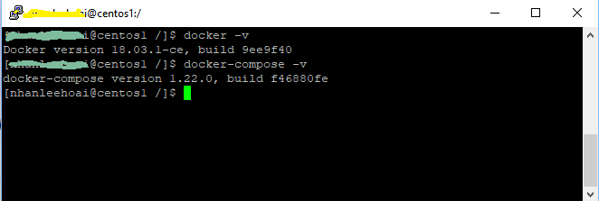
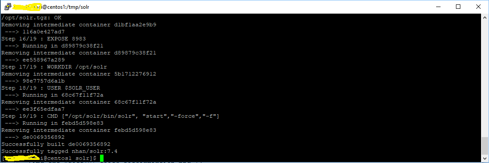
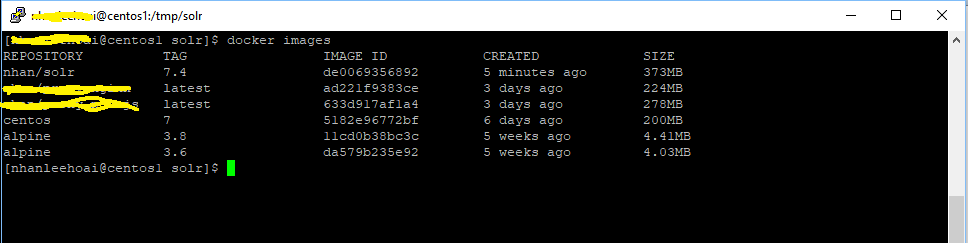
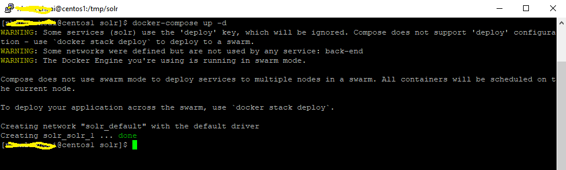
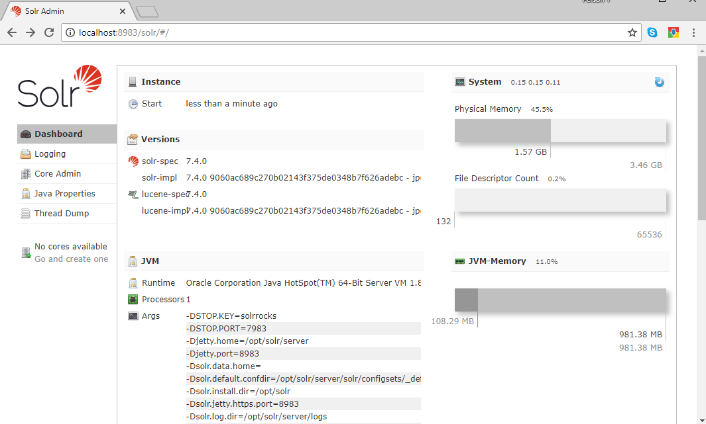
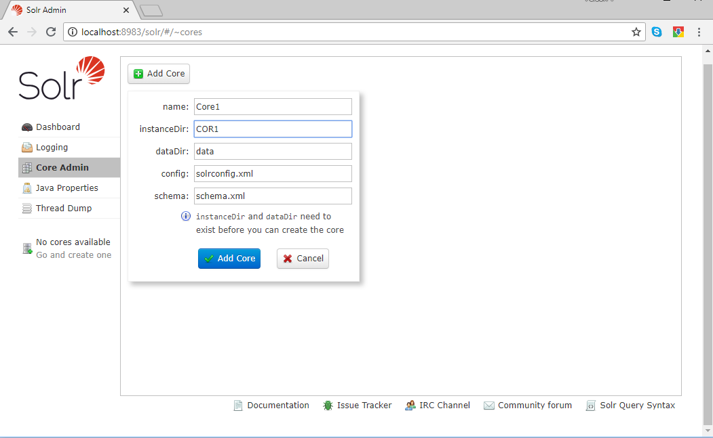
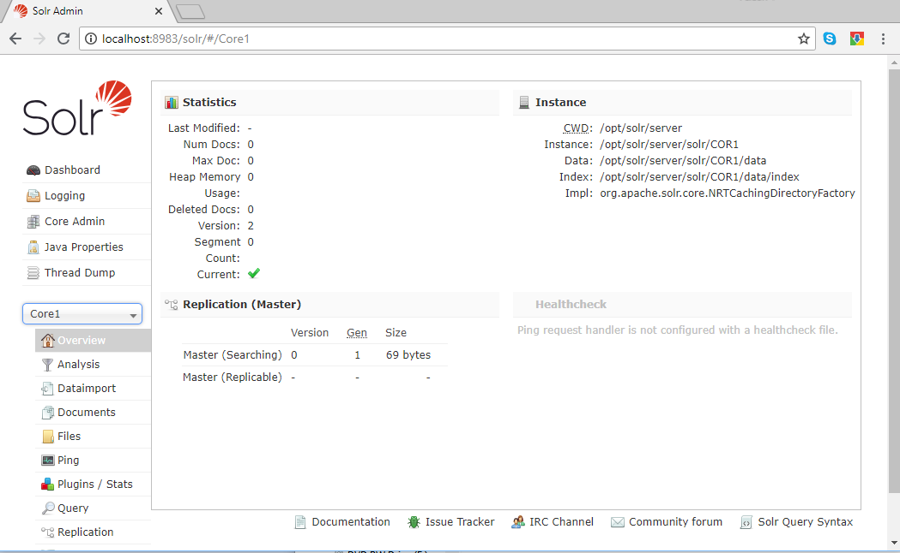

# Solr 7 on Docker container

## Prerequisite

- A CentOS 7 VM installed with Docker CE and docker-compose


To check docker version

```
docker -v
```
To check docker-compose

```
docker-compose -v
```



 
## Build the docker image

Check out all the files to a folder on docker host (CentOS 7 server). 
Change the current directory to that folder
Run the command below. It tags the image with "nhan/solr:7.4". You can change it if you want (remember to change the image name in the docker-compose.yml as well)

```
	docker build -t nhan/solr:7.4 --force-rm .
```

Ensure docker sucessfully build the image.



view the list of images to ensure.

```
	docker images
```



## Run the docker container

```
	docker-compose up -d

```


Check to ensure Solr sucessfully started by browsing the site "http://localhost:8983/solr"
You can browse on the Docker host machine OR refer to one of my guides on how to configure port forwarding 8983 thru SSH port 22
(this is recommended because you dont have to install GUI on the docker host, and we dont have to open the firewall)




## Create a sample COR

Note that you must copy the folder COR1 to Docker host (Centos 7 server) folder /opt/solr
This folder is then mapped to the container folder /opt/solr/server/solr/COR1

Therefore, when you create a new Core in the folder "COR1", all config files are available


 


 We have sucessfully created and run Solr 7.4 on Alpine linux!
 

